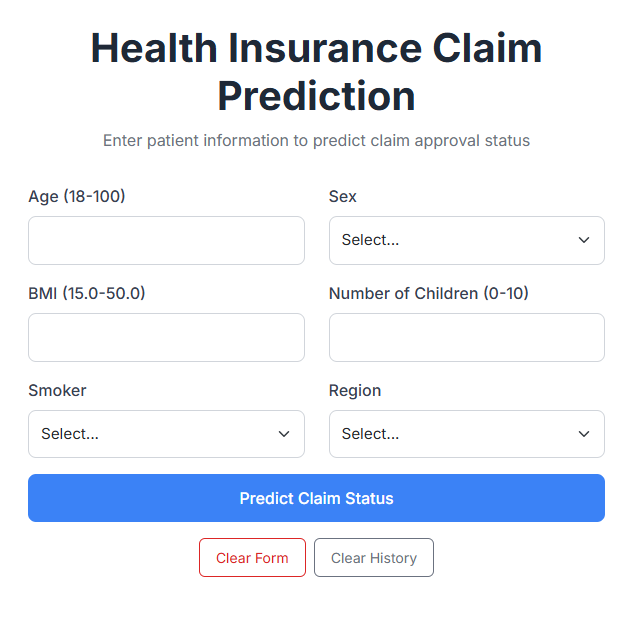
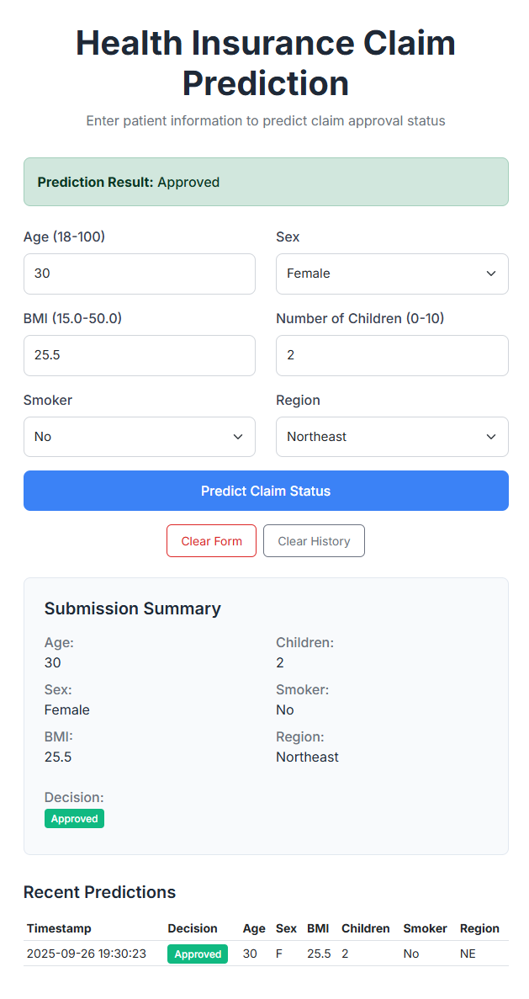
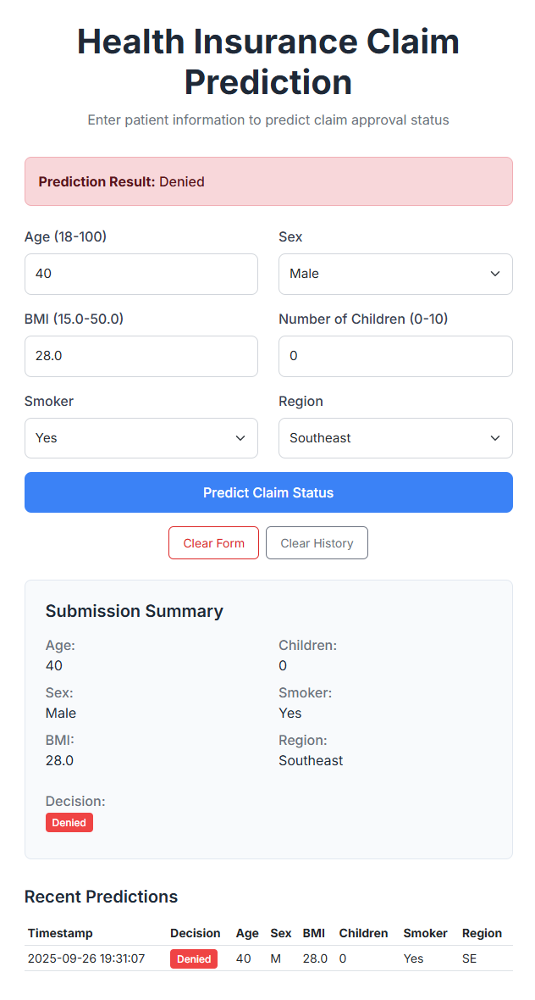

# Health Insurance Claim Prediction

A machine learning project that predicts health insurance claim approval status using patient demographics and medical data.

## Business Summary

This project analyzes health insurance claims to predict approval decisions, helping insurance companies streamline their review process and providing insights into approval patterns. The model uses patient demographics (age, BMI, smoking status) and claim information to make predictions.

## Results Summary

| Metric | Value |
|--------|-------|
| **Best Model** | Logistic Regression |
| **Accuracy** | 66.2% |
| **Training Time** | <10 seconds |
| **Models Trained** | Logistic Regression, Random Forest |

## Prerequisites

- **Python 3.13 (recommended)** or Python 3.10+
  Tested on: Python 3.13 with scikit-learn 1.7.2, NumPy 2.2.x, SciPy 1.16.x, pandas 2.3.x, Matplotlib 3.9.x, Flask 3.0.x.

## Quick Start

```bash
# 1) Clone
git clone https://github.com/odinruiz52/Health_Claim_Prediction.git
cd Health_Claim_Prediction

# 2) Create & activate a Python 3.13 virtual environment
# Windows (PowerShell with Python launcher):
py -3.13 -m venv venv
.\venv\Scripts\Activate.ps1

# macOS/Linux (ensure python3.13 is installed):
python3.13 -m venv venv
source venv/bin/activate

# 3) Install
pip install -U pip
pip install -r requirements.txt

# 4) Train and generate artifacts/plots
python run_pipeline.py

# 5) Run the web app
python app.py
```

Visit `http://localhost:5000` to use the prediction interface.

### Troubleshooting

- **Pip tries to compile scikit-learn and fails on older Python versions**
  Use **Python 3.13** for best compatibility with prebuilt wheels (see Quick Start).

## Project Structure

```
health-insurance-claim-prediction/
├── data/
│   └── insurance_sample.csv      # Training dataset (399 records)
├── models/
│   ├── logistic_regression.joblib
│   └── random_forest.joblib      # Saved trained models
├── plots/
│   ├── feature_importance.png
│   └── model_comparison.png      # Performance visualizations
├── tests/
│   ├── test_app.py              # Web app tests
│   ├── test_pipeline.py         # Model tests
│   └── test_metrics_io.py       # Utility tests
├── run_pipeline.py              # Main training script
├── app.py                       # Flask web application
└── requirements.txt             # Dependencies
```

## Model Performance

The models show baseline performance on the test set:

- **Best Model**: Logistic Regression with 66.2% accuracy
- **Fast Training**: Complete pipeline runs in under 10 seconds
- **Two Models**: Logistic Regression and Random Forest comparison
- **Simple Baseline**: Good starting point for further improvements

## Key Features

- **Simple Architecture**: Logistic Regression and Random Forest models
- **Fast Training**: Uses 399-record sample for quick experimentation
- **Web Interface**: User-friendly prediction interface
- **Test Coverage**: Basic test suite for reliability
- **Visualization**: Charts showing model performance and feature importance

## Usage

### Training Models

```bash
python run_pipeline.py
```

This will:
1. Load the sample dataset
2. Train Logistic Regression and Random Forest models
3. Evaluate performance and save results
4. Generate visualization plots
5. Save trained models to the `models/` directory

### Making Predictions

```bash
python app.py
```

Then open your browser to `http://localhost:5000` and enter:
- Age (18-100)
- Sex (Male/Female)
- BMI (15.0-50.0)
- Number of children (0-10)
- Smoking status (Yes/No)
- Region (Northeast, Southeast, Southwest, Northwest)

## Web App Preview

**Clean form**


**Approved example**


**Denied example**


### Running Tests

```bash
# Run all tests
python -m pytest tests/ -v

# Test specific components
python -m pytest tests/test_app.py -v
python -m pytest tests/test_pipeline.py -v
```

## Local Testing Proof

This project has been tested locally with the following results:

```bash
$ python run_pipeline.py
Training models on 399 records...
Logistic Regression Accuracy: 66.2%
Random Forest Accuracy: 63.7%
Best model: Logistic Regression
Models saved successfully.

$ python -m pytest tests/ -v
========================= 5 passed in 2.43s =========================

$ python app.py
Model loaded: logistic_regression.joblib
Flask app running on http://localhost:5000
```

## Technical Details

- **Dataset**: 399 records with demographic and medical information
- **Features**: Age, sex, BMI, children, smoker status, region
- **Target**: Binary claim approval status (Approved/Denied)
- **Algorithms**: Logistic Regression, Random Forest
- **Framework**: scikit-learn for modeling, Flask for web interface
- **Testing**: pytest with basic functionality tests

## Dependencies

Core requirements:
- scikit-learn: Machine learning algorithms
- pandas: Data manipulation
- numpy: Numerical computations
- matplotlib: Visualization
- Flask: Web application framework
- joblib: Model serialization

See `requirements.txt` for specific versions.

## Installation

1. Clone this repository
2. Install Python 3.8 or higher
3. Install dependencies: `pip install -r requirements.txt`
4. Run the training script: `python run_pipeline.py`
5. Start the web app: `python app.py`

## License

MIT License - see LICENSE file for details.